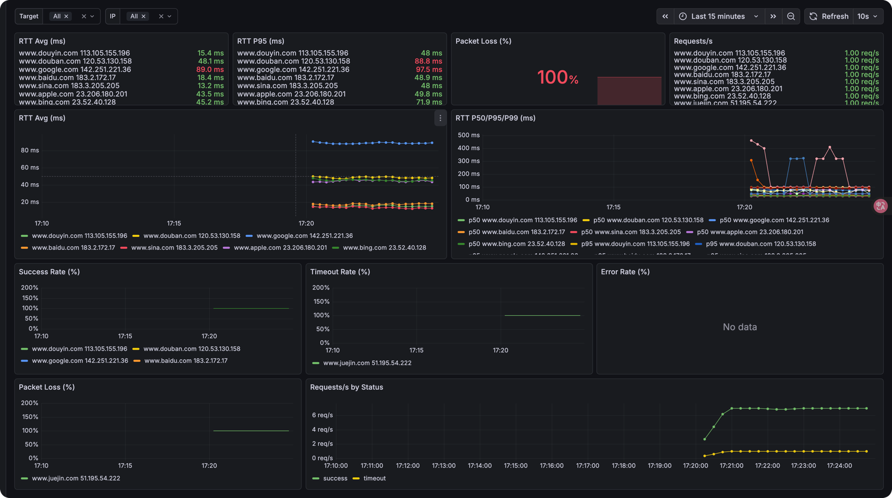

<h1 align="center"> 🏎 NBping </h1>
<p align="center">
    <em>NBping 是一个基于 Rust 开发的终端可视化 Ping 工具, 支持多地址并发 Ping, 可视化图表展示, 数据实时更新等特性 </em>
</p>
<p align="center">
    
</p>

<p align="center">
    <a href="https://hellogithub.com/repository/21f5600774554866a3d686308df2dbf0" target="_blank">
        
    </a>
<a href="https://trendshift.io/repositories/13472" target="_blank"></a>
</p>

**[新功能] 🛰️Exporter 模式**

现在 NBping 支持通过将 Ping 指标数据通过 Prometheus 格式导出，你可以使用 Grafana 等工具进行可视化展示。

```bash
nbping exporter www.baidu.com www.google.com -i 1 -p 9100
```
Then, you can scrape the metrics from `http://localhost:9100/metrics`


**图表视图**
<p align="center">
    
</p>


**表格视图**
<p align="center">
    
</p>

**点视图**
<p align="center">
    
</p>

**Sparkline 视图**
<p align="center">
    
</p>

** Exporter 模式 **
现在 NBping 支持通过将 Ping 指标数据通过 Prometheus 格式导出，你可以使用 Grafana 等工具进行可视化展示。

```bash
nbping exporter www.baidu.com www.google.com -i 1 -p 9100
```
然后你可以访问获取这些数据 `http://localhost:9100/metrics`

你可以通过 Grafana 来可视化这些数据
<p align="center">
     
</p>


## Installation

#### MacOS Homebrew
```bash
brew tap hanshuaikang/nbping
brew install nbping

nbping --help
```

## Feature:
- TCP Ping 支持
- IP 段 Ping 支持

## 后续的计划:
- UI 界面优化, 增加更多的动态效果

## Usage

```bash
nbping www.baidu.com www.google.com www.apple.com www.sina.com -c 20 -i 2

nbping --help

🏎  NBping mean NB Ping, A Ping Tool in Rust with Real-Time Data and Visualizations

Usage: nbping [OPTIONS] <TARGET>...

Arguments:
  <TARGET>...  target IP address or hostname to ping

Options:
  -c, --count <COUNT>          Number of pings to send [default: 65535]
  -i, --interval <INTERVAL>    Interval in seconds between pings [default: 0]
  -6, --force_ipv6             Force using IPv6
  -m, --multiple <MULTIPLE>    Specify the maximum number of target addresses, Only works on one target address [default: 0]
  -v, --view-type <VIEW_TYPE>  View mode graph/table/point/sparkline [default: graph]
  -o, --output <OUTPUT>        Output file to save ping results
  -h, --help                   Print help
  -V, --version                Print version
```


### Exporter Usage

```bash
nbping exporter www.baidu.com www.google.com -i 1 -p 9100

./nbping exporter --help
Exporter mode for monitoring

Usage: nbping exporter [OPTIONS] <TARGET>...

Arguments:
  <TARGET>...  target IP addresses or hostnames to ping

Options:
  -i, --interval <INTERVAL>  Interval in seconds between pings [default: 1]
  -p, --port <PORT>          Prometheus metrics HTTP port [default: 9090]
  -h, --help                 Print help
```

## 致谢
感谢这些朋友对 NBping 提出的反馈和建议。

| [ThatFlower](https://github.com/ThatFlower) | [zx4i](https://github.com/zx4i) | [snail2sky](https://github.com/snail2sky) | [shenshouer](https://github.com/shenshouer) | [vnt-dev](https://github.com/vnt-dev) | [qingyuan0o0](https://github.com/qingyuan0o0)
| [Onlywzr](https://github.com/Onlywzr)

感谢以下自媒体对 NBping 的关注和转发。

| [阮一峰的网络日志](https://www.ruanyifeng.com/blog/weekly/) |[Rust 中文社区](https://rustcc.cn/) | [公众号:奇妙的linux世界](https://mp.weixin.qq.com/s/lK_OqKp2yY8lDBoyLxtdGA) | [公众号:IT运维技术圈](https://mp.weixin.qq.com/s/bDJZ-H02dIKG3R7LQCeyaQ)
| [X:@geekbb](https://x.com/geekbb/status/1875754541905539510) | [公众号:一飞开源](https://mp.weixin.qq.com/s/BZjr54h8dIQgzr8UW3fwOQ) ｜ [公众号: 开源日记](https://mp.weixin.qq.com/s/uGtkD4x_XOFyKNbIy5pHYA)

## Star History
[](https://star-history.com/#hanshuaikang/Nping&Date)